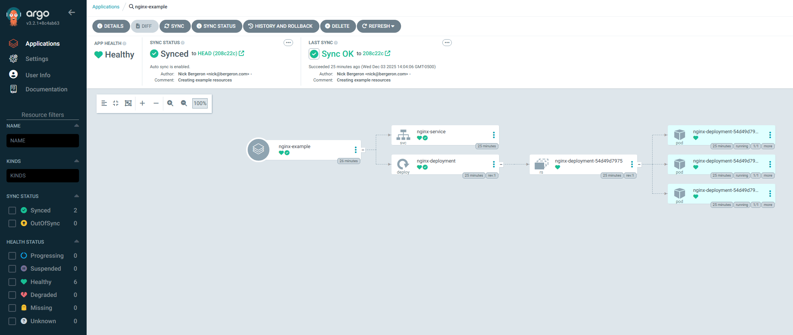

# ArgoCD

## Why Argo?

- Using the k8s [operator pattern](https://kubernetes.io/docs/concepts/extend-kubernetes/operator/) for deployments means that it will reconcile differences between source control and the cluster
- GitOps is pretty cool, but not actually required if you don't want to!
- Improved cluster recovery and MTTR. Don't redeploy every app, just ArgoCD and it will reconcile the rest! 

## Getting started

High level requirements

- A Kubernetes cluster. I'm going to use a local k3s cluster, created with [k3d](https://k3d.io/stable/)
- A repo of your choosing, with a manifest/source code/etc. 
- Basic command line knowledge
- A web browser

That's about it! (I think)

BTW, this is based on the official getting started guide [here](https://argo-cd.readthedocs.io/en/stable/getting_started/).

### The cluster

Run the following, it will create a namespace and apply the (non-HA) ArgoCD manifest.

```bash
kubectl create namespace argocd
kubectl apply -n argocd -f https://raw.githubusercontent.com/argoproj/argo-cd/stable/manifests/install.yaml
```

Install the latest stable version of the `argocd` CLI. Instructions for other platforms are [here](https://argo-cd.readthedocs.io/en/stable/cli_installation/#download-with-curl).

```bash
VERSION=$(curl -L -s https://raw.githubusercontent.com/argoproj/argo-cd/stable/VERSION)
curl -sSL -o argocd-linux-amd64 https://github.com/argoproj/argo-cd/releases/download/v$VERSION/argocd-linux-amd64
sudo install -m 555 argocd-linux-amd64 /usr/local/bin/argocd
rm argocd-linux-amd64
```

Port forward so we don't have to externally expose the service!

```bash
kubectl port-forward svc/argocd-server -n argocd 8080:443
```

Browse to [localhost:8080](https://localhost:8080/). Credentials are `admin` and the password can be found at:

```bash
argocd admin initial-password -n argocd
```

or, if you want to do this the old fashioned way, run the following:

```bash
k -n argocd get secret argocd-initial-admin-secret -o yaml | yq .data.password -r | base64 -d
```

Now you're in! 

### GitHub detour

Now we need a repo with a manifest. Example repo is public and available [here](https://github.com/nwber/argo-example).

### Creating the app in ArgoCD

Go back to [localhost:8080](https://localhost:8080/). You should be able to create a new app now. 

Click "NEW APP" and fill in the settings. Here's the YAML from my example:

```yaml
project: default
source:
  repoURL: https://github.com/nwber/argo-example
  path: k8s
  targetRevision: HEAD
destination:
  server: https://kubernetes.default.svc
  namespace: nginx
syncPolicy:
  automated:
    prune: true
    selfHeal: true
    enabled: true
  syncOptions:
    - CreateNamespace=true
```

Click `CREATE` and everything should sync! If you used a non-default namespace like `nginx` and it doesn't exist yet, then `CreateNamespace=true` will create it for you.



## Things to explore next time

- App settings: sync policies, sync options, etc.
- Refresh: `normal` vs `hard`
- Using the HA ArgoCD manifest 
- Using proper authentication methods
- Deploying to external clusters
- Diving into more functionality
