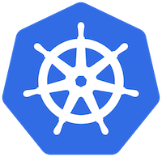

Kubernetes on a Raspberry Pi cluster

​			   

I'm new to DevOps. I just started as an Associate DevOps Engineer at Sevatec (we're hiring!) and there seem to be a million things to learn. In college, I took a Configuration Management course that ended up being DevOps 101, and I was exposed to things like Agile methodology and Infrastructure as Code. I already knew some Docker, so for a group project I figured we could learn Kubernetes. GKE is easy enough to use, but so much of the 'guts' is abstracted away in the GUI that it's almost dummy-proof. When I'm working in the cloud, I have a tendency to blow away an instance when it's acting funny. With a physical build, this will hopefully force me to learn the tools better, plus cloud bills get expensive fast. I'll be focusing on learning Kubernetes and it's respective tooling, but I'm interested in where this project may go as I learn more.

This will not be a comprehensive guide to do this yourself. However, I will link the sources I used where applicable. Inspired by Jeff Geerling's build.

Build List:

- Raspberry Pi 4B 2GB x4
- 8 port unmanaged switch
- 4 32GB microSD cards
- Ethernet and USB C cables x4
- Case for the Pis

This cluster clocks in with 16 ARM cores, 8GB RAM, 128GB of storage, and a network more than fast enough for node-to-node communication. Not exactly a high-end server but not bad for what it is.

Setting up the cluster:

- Flashed Raspberry Pi OS Lite on all of the SD cards. Boot up the pis.
- Changed their hostnames to make them easier to manage.
- I kept the default username and password just for ease of use. It goes without saying that this is a bad idea but it's just running on my home network so who cares.

- Enabled passwordless SSH access. This is trivial to do on Linux -> Linux with `ssh-copy-id` but Windows -> Linux is a tad bit harder. WSL helps, but luckily my new Macbook came about this time so that made it much easier.
- I chose k3s for orchestration, and used k3sup to install and configure the master and nodes. This is a very simple tool,  I highly recommend it.
  - I wanted to use a 'lite' version of k8s because resources on this build are a little tight. k3s makes it possible to run on systems with as little as 512MB of RAM. Other options are 'full-fat' k8s or other distributions like Openshift or Tanzu but we're aiming for minimizing overhead here. It's not recommended to use k3s in a production environment, but for a dev sandbox like this, it works fine. There are other lite distrobutions of k8s but k3s is considered the simplest to set up from my research into this.
  - I used a tool called k3sup (pronounced ketchup) to install and configure k3s. This is a simple tool that can set up the entire cluster in ~10 commands.
- One important thing to do is `scp` your /.kube/config file onto your local machine. This allows you to run kubectl commands such as `kubectl get pods` without sshing into your master every time you want to run a command.
- Troubleshooting some weird issues with the k3s-agent.service on one of my nodes, simply uninstalling and reinstalling did the trick.

Running some apps:

- This is where things get interesting. There's a million articles like "How to deploy XYZ software to Kubernetes". However, most of these will not work as the container images they pull are usually based on x86. Being an ARM based platform, these are incompatible. However, I am far from the first person to have this problem and quite a few of them have documented their journey.
- Kubernetes Dashboard
  - Made by the team that makes Kubernetes, this actually is compatible with ARM. The install is fairly straightforward, but doesn't offer the most utility. The graphs and charts are nice, but I couldn't get the deployments via the dashboard to work and running it can be a pain. So...

- Prometheus, Grafana, and AlertManager.

  - You might think you could just google `install prometheus on kubernetes` and get the steps to install - you would be wrong. That would would bring you to a CoreOS/kube-prometheus repo, and this would work fine on a full-fat Kubernetes install. However the container images that repo pulls are x86, and won't work on ARM processors. This leads you to use the carlosedp/cluster-monitoring repo, designed for cross-architecture clusters. Just clone the repo, edit the config file, and follow the steps to build the manifests, and you have Prometheus, Grafana, and Alertmanager running.

  

  

  

  

- Anyway, now it's time to have fun. I installed a minecraft server! It runs smooth enough. If anyone wants to come over and play Minecraft feel free, my parents said it's ok.

What's next:

- Dive deeper with some of the apps I've installed. Set up some Grafana dashboards, AlertManager notifications, etc.
- It's one thing to run applications other people built, and it another to build it yourself. So next I would like to build something simple like a web server from the ground up. To build on that, I'm also interested in technologies like GitOps and Chaos Engineering so I might try to sprinkle in some of that once I get a handle on the infra.
- A technology that I find interesting is serverless computing, so I'd like to get a project like openFaaS running.
- Because I won't be using this cluster 99% of the time, I'd like it to be useful when I'm not tinkering on it. There are projects to get Folding@Home running in Kubernetes so I'd like to do that as well.
